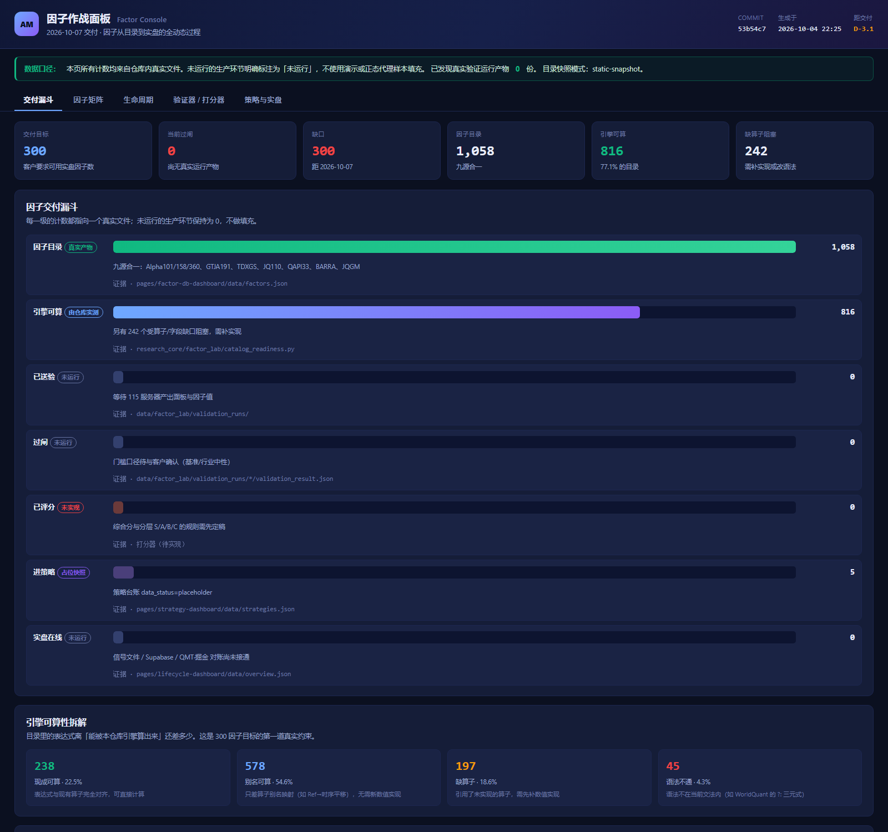
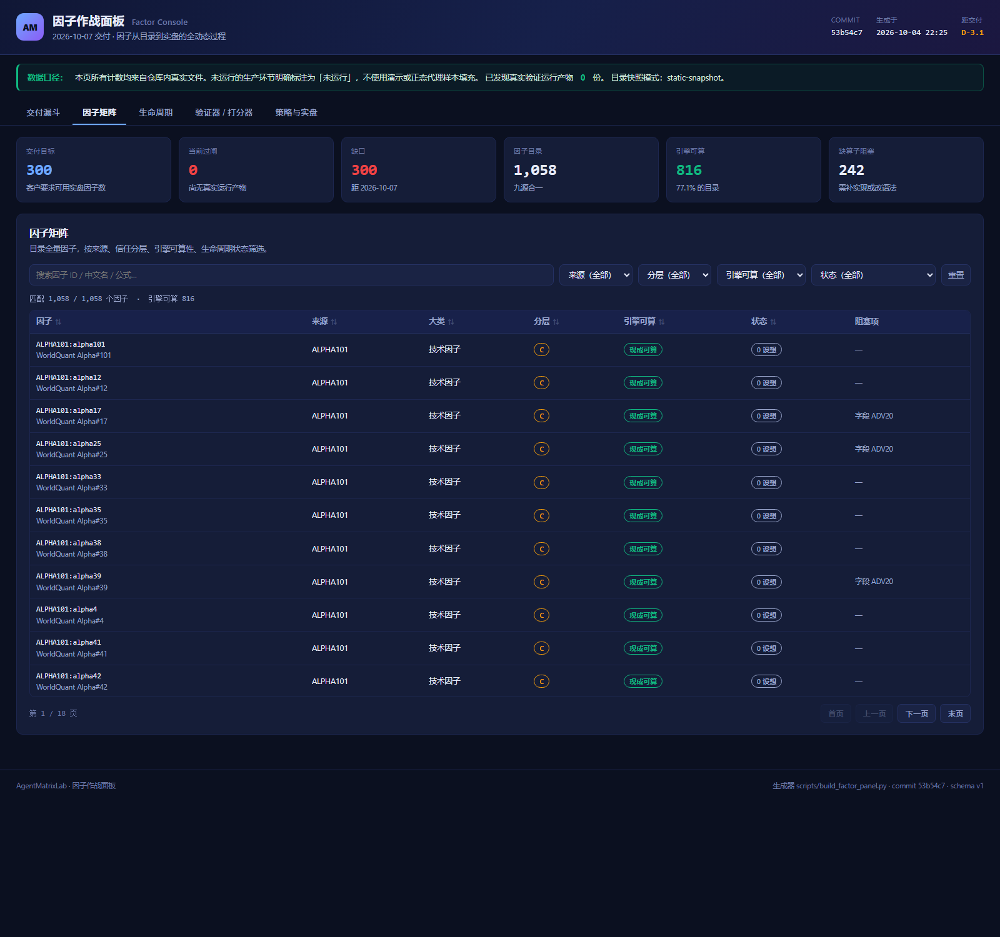
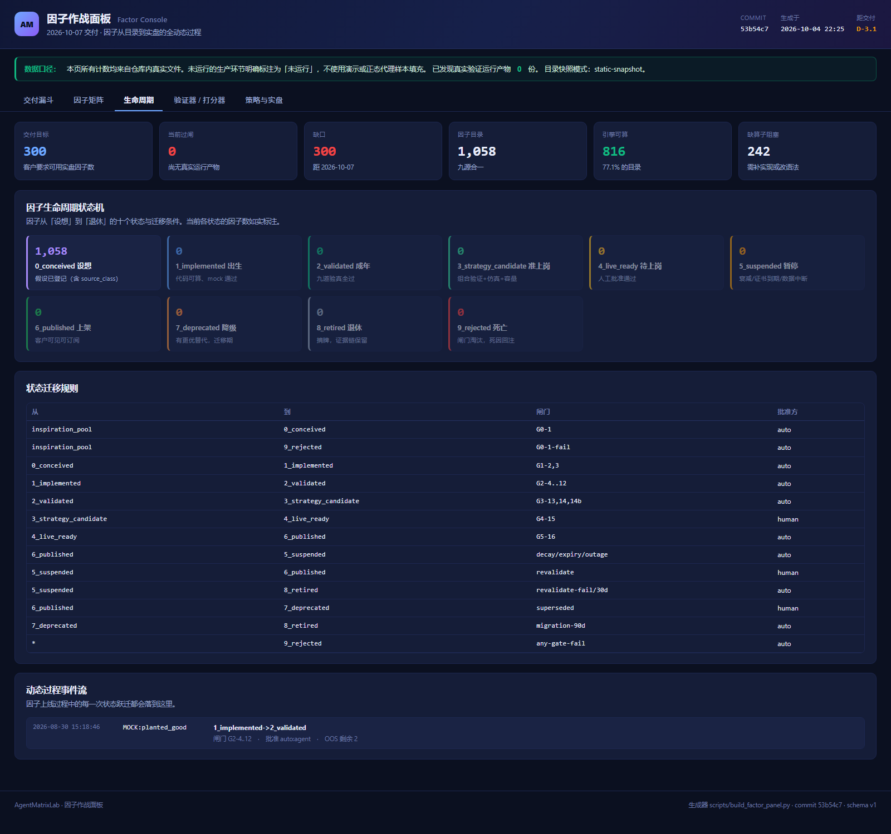

# 2026-10-07 交付系统规划：从「91 个冻结候选」到「300 个实盘可用因子」

> 状态：**待讨论稿（v1）**。本文所有数字都标注了来源；标「推断」的地方是未经运行验证的判断。
> 编制时间：2026-10-04 22:30（Asia/Shanghai）｜距交付 **D-3**
> 基线 commit：`53b54c7`｜仓库：`AgentMatrixLab/agentmatrix-research`

---

## 0. 一句话结论

**目标本身可达，但当前口径与它不一致，而且真实产物为 0。**

三道缺口，按严重度排序：

| # | 缺口 | 现在的数 | 10/7 需要 | 性质 |
|---|---|---|---|---|
| 1 | **口径** | 冻结候选 **91**（有效 Alpha 81） | **300** | 行政决策，不是技术问题 |
| 2 | **真实产物** | 真实验证运行 **0** 份 | 300 个过闸因子的完整证据链 | 阻塞，等 115 服务器数据 |
| 3 | **引擎覆盖** | 目录 1058 中只有 **816（77.1%）** 能被本仓库引擎算出来 | ≥95% 覆盖 | 工程，2 天内可闭合 |

第 3 项我这一轮已经量化并给出了闭合路径（见 §7）；第 1 项必须你拍板；第 2 项不是我们这边能单方面解决的。

---

## 1. 现状盘点（全部有证据）

### 1.1 交付主线

| 项 | 事实 | 证据 |
|---|---|---|
| 冻结候选数 | **91**（= 134 − G2 剔除 43，含 10 个风险暴露）；有效 Alpha **81** | `docs/delivery/acceptance_checklist.md:9` |
| 候选权威来源 | `candidate_list.csv`（**未到**） | 同上 |
| 切分（已冻结） | train `2020-01-02~2022-12-31`／OOS `2023-01-01~2026-08-31` | `configs/validation_gates.yaml:35-39` |
| 门槛（已冻结） | **8 道**：coverage / rank_ic / oos_seal / style_r2 / residual_ic / cost_adjusted_return / dd_vol_ratio / parameter_perturbation | 同上 `:114-136` |
| 成本假设 | 佣金 1.5bp/边 + 印花税 10bp 卖出 + 冲击 8.5bp/边，**往返 0.003** | 同上 `:103-107` |
| 真实验证运行 | **0 份**（`data/factor_lab/validation_runs/` 不存在） | 本轮实测 |
| 工作区状态 | `git status` 干净；`main == delivery/2026-10-07` | 本轮实测 |

### 1.2 因子目录（1058）

来自 `pages/factor-db-dashboard/data/factors.json`（静态快照，2026-08-30 生成）：

| 来源 | 数量 | 频段 |
|---|---:|---|
| ALPHA360 | 360 | 日频（6 字段 × 60 滞后） |
| GTJA191 | 191 | 日频 |
| ALPHA158 | 158 | 日频（9 K线 + 4 价格 + 145 滚动） |
| JQ110 | 109 | 日频 |
| ALPHA101 | 101 | 日频 |
| TDXGS | 88 | 日频 |
| QAPI33 | 33 | **月频**（RQData 月频因子表） |
| BARRA | 11 | 风险暴露（**不是 alpha**） |
| JQGM | 7 | 月频（国密/风格） |
| **合计** | **1058** | |

**信任分层现状：S=0，A=0，B=33，C=1025，D=0。**

这一行要正面读：**目前没有任何一个因子达到过「九道验真」级别。** 33 个 B 只是「真实数据可查」，1025 个 C 只做过 mock 计算逻辑验证。目录规模（1058）不是交付数量，验收清单第 8 行已经明确禁止拿它当交付口径。

### 1.3 已有能力（有代码 + 有测试）

- **验证器**：`research_core/factor_lab/deterministic_validation.py`（53 KB）——全 A 准入过滤 → 切分 → 8 道门槛 → 成本模型 → 产出 `validation_report.md` / `validation_result.json` / `run_manifest.json` + `result_hash`。
- **批量与并行**：`batch_validation.py`（`validate-batch`）、`merge_batches.py`（分片合并，硬校验各片哈希一致、因子不重叠）、`package_delivery.py`（只收 validated，空包以退出码 4 拒绝出包）、`cross_check.py`（独立重算全哈希逐项对齐）。
- **两条等价通道**：内置 transform 与预计算因子长表 Parquet 对同一因子必须给出**相同 `result_hash`**（有等价测试）。
- **离线面板通道** `--panel-file`：sidecar 校验 SHA-256 / 列 / 类型 / `(date,code)` 唯一 / 日期区间 / 行数，不符即报错。
- **表达式引擎**：`formula_compiler.py` + `operators.py`（47 个算子，含 `indneutralize`、`industry_neutralize`、`rolling_regression_beta`）。
- **测试**：28 个测试文件、156 个用例（153 passed / 3 已知 Windows 平台失败）。

### 1.4 展示层（GitHub Pages 门户，4 张卡）

| 面板 | 数据 | 状态 |
|---|---|---|
| Factor Lab 看板 | Supabase | 实时 |
| 因子生命周期监控 | 静态快照 | **38 个因子，其中 37 个是 `planted_*` 合成夹具** |
| 策略面板 | 静态快照 | 5 策略，`data_status = "placeholder"` |
| 因子库目录 | 静态快照 | 1058 因子 |

**新交付**：本轮新建 `pages/factor-panel/`「因子作战面板」，把上面四张卡的信息合成一条交付漏斗，并新增**引擎可算性**维度（§6）。截图见 `docs/delivery/assets/factor-panel-*.png`。

### 1.5 环境与授权

| 项 | 事实 |
|---|---|
| 本机 Python | **3.13.2**；pandas 2.2.3 / numpy 2.2.6 / pyarrow 25.0.1 / scipy / sklearn / flask / supabase 可用 |
| 本机缺 | **`rqdatac` 未安装、`qlib` 未安装** |
| 数据授权 | RQSDK + RQDATA 采购在 **115 服务器**，conda 环境名 `rqsdk`（rqdatac 3.5.2 / rqsdk 1.7.1，见 `constraints-rqsdk.txt`） |
| 数据服务 | 115 上有 Quant API（`:8765`），只读查询端点 |
| 本机数据 | `data/` 目录为空 —— **本机没有任何真实行情数据** |

### 1.6 姊妹仓库 `samzhang8/model`（你说的「展示仓库」）

- RQData 因子目录 **10443** 条；**已下载 300**（CORE300），覆盖 **5449 只**股票，`2020-01-02 → 2026-09-30`，**缺失率 12.44%**。
- G2 筛选（2026-10-03）：134 个价量因子 → **89 个候选**（8 个冗余簇，剔除 45 个）。
- `verify_all.py` 7 道门槛（IC bootstrap CI 不含 0 / OOS IC ≥ 70% 样本内 / 扛住 30bp 成本 / 市值中性 / ≥3 个市场状态 / 换手 < 50% / OOS 年化 > 10%）。
- **93 个策略只有 2 个验真通过**（N5+3% 止损 +27.7% 年化 / Sharpe 0.92 / MDD 28.3%）。

⚠️ **它和本仓库的数字对不上**：89 vs 91、10443 vs 1058、切分也写着旧的 `2016-01-01~2023-12-31`。对客审阅时极易混。**需要指定一个唯一权威口径。**

⚠️ **安全问题（需立即处理）**：该公开仓库的 `docs/api_keys.json` 把一个 `fa_` 开头的 API key 当作**属性名**提交了，`docs/api_billing.jsonl` 每行还有 `key` 字段。**建议轮换该 key 并移出仓库。**

---

## 2. 三个必须先拍板的口径问题（阻塞 300 目标）

### 问题 A：300 是否要求「两两低相关」？

这是**本规划里最关键的一问**。

- 目录里 ALPHA360 的 360 个因子 = 6 个字段 × 60 个滞后，彼此相关性极高，本质上是 **6 个信息维度**。
- ALPHA158 的 145 个滚动特征同理，大量共线。
- 现有 `g12_redundancy` 设计口径是 **相关性 < 0.7 + 增量 IC ≥ 70%**。

**如果客户要求 300 个两两相关性都低于门槛的因子，从这些库里基本做不到。**
**如果 300 = 过闸因子总数（允许相关），再另附一个低相关核心集给策略用，则可做。**

→ **建议口径**：300 = 过闸因子总数；同时交付「低相关核心集」（按相关性聚类，每簇取代表，预估 60–120 个），策略只用核心集。**请确认。**

### 问题 B：门槛评的是「绝对多空」还是「相对基准超额」？

本轮实测：**基准 `000985` 完全没有被任何门槛使用。** 全仓 `000985` 只出现在 `research_core/data_loader/rqdata_panel.py` 的契约校验里；`deterministic_validation.py` 里 `benchmark` / `excess` / `industry` **0 命中**。

也就是说，现在评的是**绝对多空收益**，成本门槛也是拿净值对 0 比较。

晨星这类基金评级/研究机构的通行口径是**同类/基准相对的超额收益 + 风格归因**（把 alpha 从因子 beta 里分出来）。**如果客户期望的是相对 000985 或沪深300的超额，现行门槛跑完了也要重跑。** 需要先定口径。

### 问题 C：打分器规则

**当前仓库有验证器，没有打分器。** 把 8 道门槛结果折算成「一个可排序的综合分 + S/A/B/C 交付分层」的规则尚未落地。

没有它，「过闸」与「可上线」之间没有可解释的桥梁，300 个因子也无法排序、无法向客户解释取舍。**需要冻结打分口径。**

---

## 3. 目标定义建议

| 层级 | 判定 | 数量目标 | 用途 |
|---|---|---:|---|
| **S** | 官方真值逐点对照通过（`max_abs_diff ≈ 0`）+ 8 道门槛全过 | 30–101 | 旗舰，实现无偏差可证 |
| **A** | 8 道门槛全过（+ 基准超额 / 行业中性 / FDR，见 §5） | **300** | **本期交付口径** |
| **B** | 真实数据已接入、门槛部分通过 | 不限 | 研究输入，不构成投产依据 |
| **C** | 仅 mock 验证 | 不限 | 不上线 |

**「实时可用」的完整定义（建议写进合同）**：一个因子算「可用」，当且仅当同时满足

1. 通过全部上线门槛，且门槛未被为通过而调整（`diff` 为证）；
2. 在**样本外区间**（2023-01-01 起）有可复核的 IC / 组合表现；
3. **扣成本后**仍有正收益（往返 0.003）；
4. 有**明确的实盘信号产出路径**：因子值 → 每日信号文件 → 可被 QMT/掘金直接消费；
5. 证据链可复现：`run_manifest.json` + `result_hash` 可独立重算。

---

## 4. 系统架构（六层）

```
┌─ L6 面板与动态过程 ── 因子作战面板 / 生命周期看板 / 交付报告
│    └ 每个因子的状态迁移事件流，全链路可追溯
├─ L5 实盘信号平面 ──── 每日信号文件(CSV/JSON) · Supabase 信号表 · QMT/掘金对账
│    └ 成交回传 → 偏差报告 → 因子上线/降级决策
├─ L4 策略平面 ─────── 因子加权/优化 → 目标持仓 → 回测 → 组合验证 / 容量
│    └ 多策略并行，样本外滚动观测
├─ L3 打分器 ───────── 综合分 0-100 · S/A/B/C 分层 · 相关性去重
├─ L2 验证器 ───────── 8 道冻结门槛 + 基准超额 + 行业中性 + FDR 多重检验
├─ L1 因子定义平面 ─── 1058 条目录 → 机器可读 spec → 表达式引擎 → 扰动变体
└─ L0 数据平面 ─────── RQData/RQSDK → ETL → 不可变面板快照(Parquet+sidecar+SHA256)
     └ Point-in-time 纪律 · 数据集版本化 · 派生日线/财务分离
```

**设计原则**（沿用仓库既有原则）：契约先行、引擎无关、不静默降级、可复现。

---

## 5. 验证器 v2：需要补的四件事

在**不修改已冻结门槛**的前提下，把它们**包一层**更严格的口径。冻结的是「不要为通过而改阈值」，不是「不许补新维度」。

| # | 补充 | 为什么 | 工作量 | 状态 |
|---|---|---|---|---|
| 1 | **基准相对超额** | 现在只评绝对多空；晨星口径要超额 | 0.5 天 | ✅ 已实现（`robustness.excess_ic`） |
| 2 | **行业中性化残差 IC** | 风格回归只覆盖 size/momentum/volatility/liquidity，**没有行业哑变量** | 0.5 天 | ✅ 已实现（`robustness.industry_neutral_ic`） |
| 3 | **多重检验校正（BH-FDR）** | 一次跑 900+ 因子，不做校正必然假阳性 | 0.5 天 | ✅ 已实现（`robustness.benjamini_hochberg` + `supplementary.py`） |
| 4 | **无窗口因子的扰动豁免** | 现行规则下无窗口因子永远无法通过 `parameter_perturbation` | 0.5 天 | ⏳ 待口径确认 |

**实现方式（关键）**：这三项都在**独立的追加层**里，`configs/validation_gates.yaml` 与 `deterministic_validation.py` **一行未动**。
新增的 `robustness.py` 在 AST 层面被测试断言**不导入** `yaml` / `load_validation_config` / `deterministic_validation`，且冻结流水线被断言**不导入** `robustness`。
所以「只能更严、不能放水」是**结构性保证**，不是口头承诺 —— 有测试守住（`tests/test_only_frozen_delivery_contract.py`，11 个用例把冻结的切分/门槛/成本逐值钉死）。

### ⚠️ 一个必须先拍板的发现：FDR 会让 300 目标显著变难

冻结门槛 `rank_ic` 是**单侧** |t| ≥ 1.65（≈ 单侧 5%，等价双侧 p = 0.0997）。
而 BH-FDR 用的是**双侧** p 值，且第 k 名必须满足 `p_(k) ≤ k/N × q`。

**实测敏感度表**（dof ≈ 419，q = 0.05）：

| 第 k 名 | N=300 | N=500 | **N=900** | N=1058 |
|---|---|---|---|---|
| 第 1 名 | \|t\|≥3.80 | \|t\|≥3.93 | \|t\|≥4.07 | \|t\|≥4.11 |
| 第 50 名 | \|t\|≥2.65 | \|t\|≥2.82 | \|t\|≥3.01 | \|t\|≥3.06 |
| 第 100 名 | \|t\|≥2.40 | \|t\|≥2.59 | \|t\|≥2.79 | \|t\|≥2.84 |
| **第 300 名** | \|t\|≥1.97 | \|t\|≥2.18 | **\|t\|≥2.40** | **\|t\|≥2.46** |

**读法**：从 900 个因子的批次里交付 300 个，第 300 名的 p 值必须 ≤ 300/900×0.05 = 0.0167，也就是 **|t| ≥ 2.40** —— 比门槛的 1.65 **严得多**。

这不是我们选了更严的阈值，而是多重检验控制的**数学性质**。后果：**如果坚持「300 个全部通过 FDR」，本期很可能交不满 300。**

→ 已列为 **Q10**（见决策单），三个选项需要客户拍板。**这是目前对 300 目标威胁最大的单一因素。**

> ⚠️ 另需修一个**正确性缺陷**：`formula_compiler.py:508-512` 对**未识别的函数名**兜底生成 `NAME(...)` 源码，`compile_formula` 会**成功返回**，错误直到执行时才以 `NameError` 暴露。**「编译通过」不能当作「可计算」的证据。** 本轮新增的 `catalog_readiness.py` 用 AST 走查补齐了这个判定。

---

## 6. 因子作战面板（本轮已交付原型）

新建 `pages/factor-panel/`，零构建静态页，数据由 `scripts/build_factor_panel.py` 从仓库真实产物生成。

**五个视图**：

1. **交付漏斗** —— 目录 1058 → 引擎可算 816 → 已送验 0 → 过闸 0 → 已评分 0 → 进策略 5 → 实盘在线 0。每级都带**证据文件路径**与**状态徽标**（真实产物／由仓库实测／未运行／占位快照／未实现）。
2. **因子矩阵** —— 1058 行，可按来源／分层／引擎可算性／生命周期状态筛选与搜索，点击进入详情抽屉（公式、阻塞算子、缺失字段、定义、门槛实测）。
3. **生命周期** —— 10 个状态 + 13 条迁移规则 + 动态事件流。
4. **验证器／打分器** —— 8 道冻结门槛的阈值、切分、成本与风格暴露；打分器标注为**未实现**。
5. **策略与实盘** —— 策略台账 + 六步信号链路（快照 → 验证 → 合成 → 信号文件 → Supabase → 对账）。

**诚实性约束**：页面顶部横幅明写「未运行的生产环节标注为未运行，不使用演示或正态代理样本填充」，并显示**已发现的真实验证产物份数**。数据源里那张「正态代理样本」的演示分布图**没有被搬进来**。

**截图**（本轮实测渲染，commit `53b54c7`）：

| 视图 | 截图 |
|---|---|
| 交付漏斗 + 引擎可算性 | `docs/delivery/assets/factor-panel-funnel.png` |
| 因子矩阵（1058 行 + 筛选 + 分页） | `docs/delivery/assets/factor-panel-matrix.png` |
| 生命周期状态机 + 事件流 | `docs/delivery/assets/factor-panel-lifecycle.png` |
| 验证器 / 打分器 | `docs/delivery/assets/factor-panel-gates.png` |
| 策略与实盘信号链路 | `docs/delivery/assets/factor-panel-live.png` |
| 门户五卡 | `docs/delivery/assets/portal-five-cards.png` |







---

## 7. 引擎覆盖率：本轮量化的核心工程结论

**现状：目录 1058 条表达式，本仓库引擎只能算 111 条（10.5%）。**

根因定位（本轮实测）：

- **主因：词法器不认识 Qlib 的 `$` 字段前缀。** ALPHA158/360、GTJA191、JQ110、TDXGS、JQGM 全部用 `$close` 写法，tokenizer 的正则在 `$` 上直接报错。
- **次因：算子别名。** 目录混用 `Ref` / `Ts_DecayLinear` / `Correlation` / `StdDev` 等写法，注册表只认 `DELTA` / `DECAY_LINEAR` / `CORR` / `STD`。
- **三因：真缺算子。**

**分级闭合路径（实测数字）**：

| 阶段 | 动作 | 可算因子 | 占比 | 状态 |
|---|---|---:|---:|---|
| 原始 | — | 111 | 10.5% | 基线 |
| +1 | 词法器接受 `$` 前缀 + 补 `TS_DELAY`/`TS_PRODUCT`/`TS_ARGMAX`/`TS_ARGMIN`/`POWER`/`SIGNED_POWER`/`GREATER`/`LESS` | 255 | 24.1% | ✅ **已完成** |
| +2 | 加算子别名表（`Ref`/`Delay`/`Ts_*`/`Correlation`/`StdDev` 等，**语义逐条核对**） | 816 | 77.1% | ✅ **已完成** |
| +3 | 补统计与指标算子（EMA / SLOPE / RSQUARE / RESI / QUANTILE / IDXMAX / IDXMIN / BIAS / RSI / BOLL / ATR / CCI） | **913** | **86.3%** | ✅ **已完成** |
| +4 | 剩余 100 条：TRIX / VPT / BBI / VR / CR / AR / BR / MFI / PSY / ADX 族等 + 财务字段 | ~1013 | ~96% | 待做 |

**目录可算率 10.5% → 86.3%**，`needs_numerics` 从 197 降到 **100**。

**新算子的语义全部来自 Qlib 源码，不是猜的**（本机 `D:\Qlibexample\qlib` 有完整 checkout）：

| 算子 | 定义来源 | 关键点 |
|---|---|---|
| `IdxMax/IdxMin(x,N)` | `qlib/data/ops.py:933` | 返回窗口内**从窗口起点数的 1-based 位置**（`argmax()+1`），**不是归一化值**，取值 ∈ [1,N] |
| `Slope(x,N)` | `qlib/data/_libs/rolling.pyx:49` | 对 `t=1..N` 做 OLS 的斜率，窗口内 NaN 剔除而非补零 |
| `Rsquare(x,N)` | 同上 `:137` | 该回归的 R²，∈ [0,1] |
| `Resi(x,N)` | 同上 `:91` | **当前 bar** 相对拟合线的残差（在 `t=N` 处取值） |
| `Quantile(x,N,q)` | `qlib/data/ops.py:990` | 滚动分位，注意参数顺序是 **(窗口, 分位)** |
| `EMA(x,N)` | `qlib/data/ops.py:1284` | `ewm(span=N)`，pandas 默认 `adjust=True`；N∈(0,1) 时按衰减因子处理 |

`ATR`/`CCI`/`RSI`/`BOLL`/`BIAS` 用各自唯一通行的定义实现，并在测试里钉住关键性质（`RSI∈[0,100]`、`Rsquare∈[0,1]`、上轨≥下轨、`ATR` 必须用跳空缺口而非当日振幅）。

**顺带修掉一个正确性缺陷**：`formula_compiler` 原先对**未识别的函数名**兜底生成 `NAME(...)` 源码，`compile_formula` **成功返回**，错误直到执行时才以 `NameError` 暴露。现在改为在编译期抛 `UnsupportedOperatorError`，并有测试断言「分类器判定可算 ⟺ 编译器能编译」。

**`GREATER` / `LESS` 的语义已核实（不是猜的）**。它们被 57 条 GTJA191 表达式使用。逐个对照原版公式确认是**两参数逐元素 max/min**，不是 0/1 选择器：

| 表达式 | 上下文 | 只能是 |
|---|---|---|
| GTJA003 | `CLOSE - Less(LOW, DELAY(CLOSE,1))` | `MIN(LOW, 昨收)` |
| GTJA003 | `CLOSE - Greater(HIGH, DELAY(CLOSE,1))` | `MAX(HIGH, 昨收)` |
| GTJA052 | `Greater(HIGH - DELAY(TP,1), 0)` | `MAX(x, 0)` 截断 |
| GTJA077 | `Less(RANK(a), RANK(b))` | 两个 rank 取小 |

> 注意：这**不是**引擎里已有的 `MAX`/`MIN`（那两个是滚动窗口算子），所以映射到 `np.maximum`/`np.minimum`。有测试守住这个区分。

**仍然刻意不做的映射**：任何语义存在多种约定、无法用上下文唯一确定的拼写，**一律保持为阻塞项**，不做猜测。理由：未解析的调用会被如实报成 blocker，而猜错会静默产出一个「数字上通过、但没人能解释」的因子。

**阶段 +3 需要补的算子（按阻塞因子数排序，实测）**：

```
EMA×22  SLOPE×13  IDXMAX×10  IDXMIN×10  QUANTILE×10  ATR×8  CCI×6
RESI×5  RSQUARE×5  RSI×4  BOLL_UP×4  BOLL_DN×4  TRIX×4  VPT×4
VARIANCE×3  SKEWNESS×3  KURTOSIS×3  MFI×3  PSY×3  VR×3  CR×3  AR×3  BR×3
BIAS×3  BBI×3  ADX×2  PDI×2  MDI×2  WR×2  …
```

**还需要补的面板字段**（目录引用了但面板没有，实测）：

```
ADV5/10/15/20/30/40/50/60/120/180（滚动成交额） · RETURNS / DAILY_RETURN
CAP / MARKET_CAP / TOTAL_SHARES / FREE_FLOAT · INDUSTRY
```

> ⚠️ **一个必须尽早处理的接口问题**：现行面板契约（`runbook_hermes.md` §2）只有 `close, volume, total_turnover, limit_up, limit_down, circulation_a, listed_date, de_listed_date, is_st, is_suspended` —— **没有 `open` / `high` / `low` / `vwap`**。
> 而 ALPHA158 的 122 条、ALPHA360 的高开低收 240 条、GTJA191 的大部分都要 `$open/$high/$low`。
> **115 服务器的导出脚本必须一并导出这些字段，否则导完还得重导。**

---

## 8. RQData / RQSDK 怎么用

**结论：服务器侧做 ETL，本机只吃离线快照，本机不装 `rqdatac`、不碰账号。**

这已经是仓库既有的正确设计（D2 交付的离线运行手册），继续沿用，不要改。

**导出脚本已就绪：`scripts/export_rqsdk_panel.py`**（本轮新增）。在 115 服务器上：

```bash
conda activate rqsdk
# 1) 30 秒 API 体检：3 只票 1 天，把每个 RQData 调用都试一遍，报告哪个字段/权限有问题
python -X utf8 scripts/export_rqsdk_panel.py --probe

# 2) 正式导出
python -X utf8 scripts/export_rqsdk_panel.py \
    --out-dir /data/amr/export --start 2015-01-01 --end 2026-08-31

# 3) 用仓库自己的加载器自检（不联网）
python -X utf8 scripts/export_rqsdk_panel.py --out-dir /data/amr/export --self-check
```

脚本内建三条防呆规则：

1. **不静默降级**：RQData 没返回某个请求字段 → **硬报错**，不是悄悄少一列。（有测试）
2. **价格口径显式化**：`limit_up`/`limit_down` 只有和 `close` 同口径才有意义。清单里带一个**涨跌停命中率合理性检查**（合理区间约 0.05%–30%）；口径混用会直接判为不合理并**拒绝声明成功**（退出码 2）。（有测试）
3. **不推断**：列名、单位、复权口径原样写进 sidecar。`vwap` 缺失时用 `total_turnover / volume` 计算（两者同一次复权拉取，比值即复权 VWAP），**并在 sidecar 里写明是算出来的**。

**本轮已做通全链路彩排**（用合成数据，明确标注 `TEST_ONLY_SYNTHETIC`）：

```
python -X utf8 scripts/dev/make_synthetic_panel_snapshot.py --out-dir .tmp-rehearsal
python -X utf8 scripts/export_rqsdk_panel.py --out-dir .tmp-rehearsal --self-check
→ rows=24,328  7 个扩展列齐全  price_basis=post_adjusted  涨跌停合理性检查通过
```

**唯一没验证的是 RQData 调用本身**（本机没有 `rqdatac`、也不该联网），这正是 `--probe` 存在的理由：拿到凭据后先跑 30 秒体检，再决定是否拉全量。

产出：

```
validation_panel.parquet   + .json sidecar     全 A 扩展面板（含 OHLC/VWAP/行业/股本）
benchmark.parquet          + .json sidecar     000985 日收益
index_membership.parquet   + .json sidecar     沪深300/中证500/中证1000 月末成分
run_manifest.json                              以上全部 + SHA-256
```

**一个重要的架构简化（本轮引擎升级带来的）**：引擎可算率到 86.3% 之后，**因子值不再需要服务器导出** —— 本机直接从面板 + 表达式引擎算出来即可。服务器只需要导出「面板 + 基准 + 指数成分」三样。原来那条「预计算因子长表」通道仍然保留（用于扰动变体与真值对照），但**不再是交付的必经路径**，这显著降低了 R1（数据未到）的杀伤力。

**数据量估算**：全 A ~5400 只 × 2015-01-01~2026-08-31（含预热）约 2850 交易日 ≈ **1540 万** `(date, code)` 行。
因子值：913 因子 × 1540 万 = **约 140 亿个值**；float32 宽表约 56 GB 原始，Parquet+snappy 约 **20–34 GB**。
（若只保留 train+OOS 需要的窗口，可裁到约 1900 交易日 / 1030 万行，落盘减半。）

**算量结论（本轮已实测，推翻早先的解析估算）** ⚠️

早先本文写的是「8 核单机 30–60 分钟，计算不是瓶颈」。**那是解析估算，没有实测。实测下来是错的，差了一个数量级。**

实测方法：`scripts/dev/benchmark_validator_throughput.py`，跑真实的 `validate-batch`，两次对照只改横截面宽度（30 只票 vs 60 只票，日历相同）：

| 面板行数 | 票数 | 因子数 | 总耗时 | **秒/因子** |
|---:|---:|---:|---:|---:|
| 91,230 | 30 | 3 | 80.1 s | **26.70** |
| 182,460 | 60 | 6 | 163.5 s | **27.24** |

**关键观察：面板行数翻倍，单因子成本只涨 2%。** 说明主要成本不是横截面宽度，而是**每个交易日一次的截面运算的固定开销 × ~3000 个交易日**（约 26 秒/因子）。

投影到全 A（~5400 只票、同样 ~3000 个交易日）：

| 口径 | 秒/因子 | 913 因子 × 1 核 | 8 核 | 16 核 |
|---|---:|---:|---:|---:|
| **下限（实测外推最保守）** | 27.2 | 6.9 h | **0.9 h** | 0.4 h |
| 拟合（按票数线性外推，超出实测 90 倍） | 123.9 | 31.4 h | **3.9 h** | 2.0 h |

**结论：全量验证是「小时级」，不是「分钟级」。** 早先的估算是错的。

**这直接改变排期，并且让分片从「可选」变成「必需」**：

1. **必须按因子分片并行。** `scripts/merge_batch_manifests.py` 已能合并分片（并校验各片 commit / 面板哈希 / 配置哈希 / 切分一致、因子不重叠），吞吐随核数近似线性。16 核把最坏情况从 31 h 压到 2 h。
2. **必须在 10/5 用真实数据实测一次单因子耗时**（`--probe` 规模的子集即可），再定全量排期。上表的下限与拟合差 4.5 倍，只有服务器能给出真数。
3. **备用方案**：若实测落在上限且核数不足，则把候选池从 913 收到「优先 400–500 个」（按来源分族取头部），先保住 300 目标，其余 10/7 后补。

**分片路径已实测验证**（`scripts/dev/verify_sharded_batch.py`）：

| 检查 | 结果 |
|---|---|
| 3 个分片并行跑，各自产出 manifest | ✅ |
| 合并后**逐因子集合**与各片并集一致 | ✅ |
| 合并后**状态计数**与各片之和一致 | ✅ |
| 分片的面板哈希不一致 → **拒绝合并**（退出码 2） | ✅ |
| 因子在两片重复 → **拒绝合并**（退出码 2） | ✅ |

> 两条拒绝路径尤其重要：一个**静默接受**了「不同输入」的分片合并，比没有合并更糟 —— 计数看起来正常，证据链却是不一致的。

**表达式求值本身仍然不是瓶颈**（913 个因子几分钟级）；瓶颈在**逐日截面统计与 bootstrap**。

**真正的瓶颈是数据落地**（导出 + 校验 + 传输），不是计算。**建议 10/5 上午必须拿到面板。**

---

## 9. Qlib 怎么用

**结论：选择性采纳 —— 抄它的公式，不引入它的运行时。**

| 项 | 事实 |
|---|---|
| 版本 / 许可 | pyqlib **0.9.7**（2025-08-15），**MIT**，可商用 |
| Python 支持 | **只到 3.12**；无 cp313 wheel。本机是 **3.13**，装不上（除非源码编译 Cython+MSVC） |
| 数据格式 | `.bin`，**每字段每标的一个文件**；`dump_all` 从**文件名**取代码，长表 parquet 必须先按 code 拆开 |
| 价格口径 | `.bin` 里必须是**复权价**；`factor = 复权价/原始价`。搞错会**静默**让因子漂移 |
| 依赖 | 很重（lightgbm / cvxpy / gym / mlflow / pymongo / redis / jupyter），会污染主环境 |

**要的（零运行时依赖）**：
1. **Alpha158 / Alpha360 的逐字表达式**——`Alpha158DL.get_feature_config()` 返回**可读的表达式字符串**，直接搬进我们的引擎。
2. **参考实现与公开基准**——用 qlib 的 IC/回测结果校准「我们的流水线是否合理」。
3. **A 股执行细节**——`limit_threshold: 0.095`、`open_cost: 0.0005`、`close_cost: 0.0015`、100 股整手、T+1。

**不要的**：
- 不用 qlib 做生产数据层或服务层（会引入第二份数据副本和双重复权风险）。
- 不在主环境装 qlib。

**建议做法**：在隔离的 **Python 3.12 venv** 里装 qlib，**只当交叉验证的 oracle**，不进主链路。主链路的表达式引擎保持我们自己的 `formula_compiler.py`（因为验证器的 `result_hash` 依赖它）。

> 顺带：目录里的 ALPHA158/360 表达式**本来就是从 qlib 抄过来的**（`$close` 语法就是证据）。所以 §7 的词法器修复，本质上是**让我们自己的引擎能吃下 qlib 语系的公式**——这比引入 qlib 运行时便宜得多，也更可控。

---

## 10. 300 因子的达成路径

**候选池**：目录 1058 → 引擎可算 816（修词法+别名后）→ 补 top 算子后 ~1013。

**需要多高的过闸率？** 816 → 300 需要 **36.8%**。

**这个数字现实吗？** 分族看：

| 族 | 可算 | 过闸预期 | 说明 |
|---|---:|---|---|
| ALPHA360 | 360 | 中 | 本质 6 维信息 × 60 滞后，IC 覆盖广但共线极重 |
| ALPHA158 | 158 | 中高 | 经典基线，K线 + 滚动统计，很多单因子确有 IC |
| GTJA191 | 180 | 中 | 质量参差，含较多同义/失效式 |
| ALPHA101 | 65 | 中低 | 部分需要 `IndNeutralize` 与 `cap`，且原文多用 `?:` 三元式（语法不通） |
| TDXGS / JQ110 | 51 | 中 | 指标类 |
| QAPI33 | 33 | 高 | 已经在真实月频数据上可查 |

**结论：36.8% 是紧但可及的**，前提是：
1. §7 的引擎修复必须在 10/5 完成（否则分母只有 238，需要 126% 过闸率，不可能）；
2. §5 的第 4 项（无窗口因子扰动豁免）必须落实，否则会成批误杀；
3. 门槛口径（问题 B）必须先定，否则跑完要重跑。

**如果达不到 300 的备用方案**（按优先级）：
- **A**：把月频族（QAPI33 + JQGM + 财务衍生）纳入口径，扩大分母；
- **B**：从 `samzhang8/model` 的 **10443 条** RQData 目录里增补（已有 300 条下载完毕，含 5449 只股票 2020-2026 的因子值），这是**现成的第二候选池**；
- **C**：与客户协商「300 = 过闸因子 + 已接入真实数据的高潜力候选」，并对后者给出明确的上线时间表。

---

## 11. 三天排期（10/5 – 10/7）

> ✅ **全链路彩排已跑通**（`scripts/dev/rehearse_full_pipeline.py`）。用合成数据按真实顺序跑完整条链：
> 合成扩展面板 → 引擎从目录表达式算因子值 → **冻结的 `validate-batch`（八道门槛原样）** → 追加稳健性层（FDR + 行业中性）→ 打分与聚类 → 策略目标 → 信号导出 → 执行对账。
> 实测结果：60 只票 / 18.2 万行面板，12 个因子，**3 个过闸**（2 个刻意植入的信号 + 1 个真实表达式），FDR 可检验 12 个（**不是 0**），聚类 6 簇，策略产生 3 笔订单，对账正确识别出故意漏掉的一笔成交。
> **其中「2 个植入信号必须过闸、纯噪声必须基本不过」是刻意的验收条件** —— 一个把所有因子都拒掉的流水线，和一个永远拒掉的坏流水线长得一模一样，只有植入信号能区分。

### 10/5（周一）—— 口径冻结 + 数据落地 + 引擎闭合

| 时段 | 事项 | 产出 |
|---|---|---|
| 上午 | **口径冻结会**：问题 A / B / C / Q10 拍板 | 签字的口径备忘 |
| 上午 | 115 服务器导出**扩展面板**（含 OHLC/VWAP/行业/成分） | `validation_panel.parquet` + sidecar |
| 上午 | **`--probe` 体检 + 单因子耗实测** → 定分片数与全量排期 | 秒/因子实测值 |
| 下午 | 引擎修复：`$` 词法 + 别名表 → 覆盖率 77% | 可算 816 |
| 下午 | 验证器 v2：基准超额 / 行业中性 / FDR / 扰动豁免 | 门槛套件 |
| 晚 | **分片并行**跑训练段（`--segment train`），选簇代表 | 训练期报告 |

### 10/6（周二）—— 全量验证 + 打分 + 策略

| 时段 | 事项 | 产出 |
|---|---|---|
| 上午 | 全量 **OOS** 跑（816 因子，8 路并行） | `validation_result.json` × N + `batch_manifest.json` |
| 中午 | **打分器**：综合分 + S/A/B/C 分层 + 相关性聚类去重 | 排序后的交付清单 |
| 下午 | 策略合成（因子加权 → 目标持仓）+ OOS 回测 | ≥3 个策略 + 净值曲线 |
| 晚 | 交叉核对 `cross_check_delivery.py` + 打包 | 交付包 + 哈希对齐 |

### 10/7（周三）—— 信号 + 对账 + 交付

| 时段 | 事项 | 产出 |
|---|---|---|
| 上午 | 每日信号文件（T-1 收盘后生成）+ Supabase 信号表 | 信号 CSV/JSON |
| 上午 | QMT / 掘金 对账演练：目标信号 vs 实际成交 | 偏差报告 |
| 下午 | 交付报告 + 面板更新 + 演练回放 | 客户材料 |
| 傍晚 | 最终验收检查清单逐条勾选 | 签收 |

> ⏱ **排期判断**：这个排期**没有任何缓冲**。任何一项延误 1 天，300 目标就要打折。**数据必须在 10/5 上午到位**，这是唯一的硬依赖。

---

## 12. 风险登记

| # | 风险 | 概率 | 影响 | 缓解 |
|---|---|---|---|---|
| R1 | **115 数据未按时到** | 中 | **致命** | 10/5 上午设硬截止；同时准备 `samzhang8/model` 已下载的 300 条作备选 |
| **R10** | **全量验证是小时级而非分钟级**（本轮实测推翻早先估算） | **高** | **高** | **必须按因子分片并行**（`merge_batch_manifests.py` 已就绪）；10/5 用真实子集实测单因子耗时再定排期；必要时把候选池收到 400–500 优先集 |
| R2 | **口径变更导致重跑** | 高 | 高 | 10/5 上午必须签字；签字后冻结 |
| R3 | 300 达不到 | 中 | 高 | §10 备用方案 A/B/C；FDR 口径见 Q10 |
| R4 | **客户质疑两两相关性** | 中高 | 中 | 提前主动给「低相关核心集」，不要等被问 |
| R5 | 引擎修复引入语义偏差 | 中 | 高 | 别名表逐条人工核对语义（`Ref`≠`Delta`）；真值对照兜底 |
| R6 | **`samzhang8/model` 的 key 泄露** | — | 中 | 立即轮换 key 并移出仓库 |
| R7 | 公开仓库曾暴露数据服务器地址 | 已缓解 | 中 | 当前树 0 命中（有守卫测试）；**仍需服务器侧轮换 admin token + 加白名单** |
| R8 | 前端门禁密码硬编码 `factorlab2026` | — | 低 | 已知设计，建议改后端校验 |
| R9 | 3 个 Windows 平台测试固定失败 | ✅ 已解决 | 低 | 根因是 SQLite 连接泄漏（`sqlite3.Connection.__exit__` 不 close），已修；全量 **434 passed / 0 failed** |

---

## 13. 需要你确认的问题

见 **`docs/delivery/2026-10-07-open-questions.md`**。其中 **Q1 / Q2 / Q3 是阻塞项**，不定就没法开工：

1. **300 的口径** —— 是否要求两两低相关？
2. **门槛口径** —— 绝对多空，还是相对基准超额？要不要行业中性？
3. **打分器规则** —— S/A/B/C 的判定标准与权重谁定？

其余（数据访问方式、实盘渠道、交付形态、相关性上限、算力、客户书面验收标准）不阻塞开工，但需要在 10/5 内闭环。
